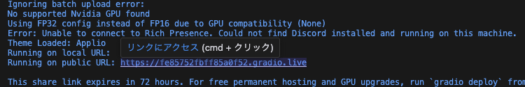
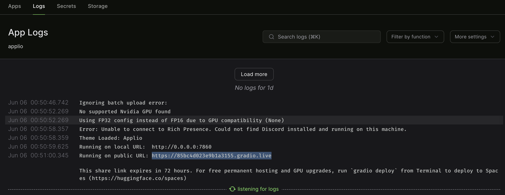

# 概要
ModalのサーバーレスGPUを使ってApplioを動かすだけ。
- [Modal](https://modal.com/)
- [Applio](https://docs.applio.org/)

# セットアップ
```
python -m venv .venv
. .venv/bin/activate
pip install -r requirements.txt
python -m modal setup
```
ブラウザでModalのページが開くので画面の指示に従ってトークンを発行する。

# 実行
1. `applio_asgiapp.py`の`local_datasets_dir`にローカルの音声データセットが格納されているディレクトリのパスを入力する。  
2. 必要に応じて`custom_pretrained_urls`を編集する。  
3. 以下のコマンドでApplioを起動する。  
```
modal serve applio_asgiapp.py
```
もしくは
```
modal deploy applio_asgiapp.py
```
4. しばらく待つとコンソールとModalダッシュボードにURLが表示されるのでどちらかからアクセスする。(この時点ではまだApplioは開けない)
5. さらに待つとコンソールとModalダッシュボードLogsにgradio public URLが表示されるのでどちらかからアクセスする。  
  
↑コンソール  
  
↑ModalダッシュボードのLogs  

# Tensorboard起動
```
modal serve logs_tensorboard.py
```
もしくは
```
modal deploy logs_tensorboard.py
```
コンソールとModalダッシュボードでURLが表示されるのでどちらかからアクセス。  

# その他のファイルについて
`applio_webserver.py`と`click_loop.py`は、`@modal.web_server`を用いたApplioの起動と学習に必要なファイル。  
ただの遠回りしてあれこれやった残骸なので無視していいです... 一応使い方は`click_loop.py`のトップコメントに書いてあります。  