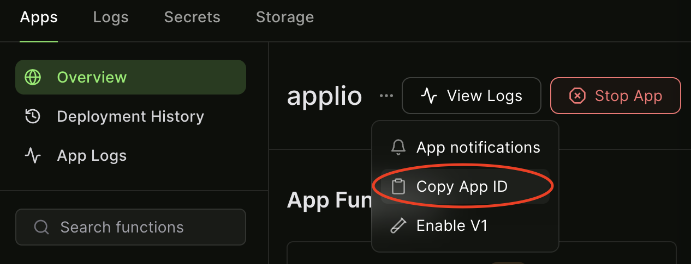

# 概要
ModalのサーバーレスGPUを使ってApplioを動かすだけ。
- [Modal](https://modal.com/)
- [Applio](https://docs.applio.org/)

# セットアップ
1. 事前にModalのアカウントを作成しておく。GitHubアカウントでログインできます。
2. 以下のコマンドを順次実行する。
```
python -m venv .venv
. .venv/bin/activate
pip install -r requirements.txt
python -m modal setup
```
3. ブラウザでModalのページが開くので画面の指示に従ってトークンを発行する。

# Applio起動
1. `applio_asgiapp.py`のトップコメントに従って諸々実行する。
2. しばらく待つとコンソールとModalダッシュボードのAppsタブにURL (https://~~~.modal.run) が表示されるのでどちらかからアクセスする。(この時点ではまだApplioは開けない)
3. さらに待つとコンソールとModalダッシュボードのLogsタブにgradio public URLが表示されるのでどちらかからアクセスする。たまにDEBUGログが出てpublic URLが埋もれることがありますが頑張って探してください。  
  
↑コンソール  
  
↑ModalダッシュボードのLogsタブ  

# Tensorboard起動(学習状況の可視化)
```
modal serve logs_tensorboard.py
```
もしくは
```
modal deploy logs_tensorboard.py
```
コンソールとModalダッシュボードのAppsタブでURLが表示されるのでどちらかからアクセスする。  

# 学習結果の保存
- Trainタブでの各工程(Prepocess Dataset、Feature Extraction、Start Training、Generate Index)の結果はModalのVolume機能によって逐一保存されます。
- これにより、特に意識しなくても学習の中断と再開が可能となっています。
- Volumeの中身はダッシュボードから確認できます。
  

- なお現在、ダッシュボードでは閲覧のみ可能でありファイルのダウンロードなどはCLIから行う必要があります。  
[Modal CLI Reference: Volume](https://modal.com/docs/reference/cli/volume#modal-volume)  
```
modal volume get [OPTIONS] VOLUME_NAME REMOTE_PATH [LOCAL_DESTINATION]
```

# 学習の自動終了
通常、何も処理をしていないコンテナは一定時間 (@app.clsの引数container_idle_timeoutに設定した秒数) で自動的に停止して待機状態になるはずなのですが、Applioのほうではそれが機能しません(Tensorboardのほうでは機能します)。  
そこで、学習終了を検知したらコンテナを強制的に止めるスクリプトを`modal_applio_stopper.py`として用意したので使用をお勧めします。  
実行方法はスクリプトのトップコメントに書いてあります。  
なおApplioのApp IDはModalダッシュボードでコピーできます。  




# その他のファイルについて
`applio_webserver.py`と`click_loop.py`は、`@modal.web_server`を用いたApplioの起動と学習に使用するスクリプトです。  
ただの遠回りしてあれこれやった残骸なので無視していいです... 一応使い方は`click_loop.py`のトップコメントに書いてあります。  
